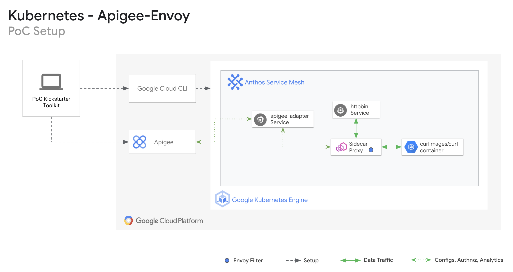
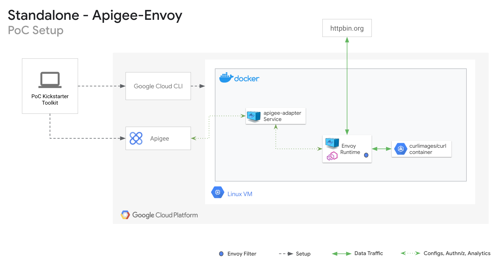

# Apigee Envoy PoC Toolkit

The Apigee Envoy Quickstart Toolkit : 

[Apigee protected ASM Envoy Proxies within Kubernetes Engine](https://cloud.google.com/apigee/docs/api-platform/envoy-adapter/v2.0.x/example-hybrid).



[Apigee protected Envoy Proxies in docker containers](https://cloud.google.com/apigee/docs/api-platform/envoy-adapter/v2.0.x/example-apigee).



## Quickstart 

### Installation

1. **[Create a Google Cloud Project](https://cloud.google.com/resource-manager/docs/creating-managing-projects)** and connect it to an existing Billing account.

2. Setup a GKE cluster. Have the cluster enabled with Anthos Service Mesh. Checkout this **[gke poc toolkit](https://github.com/GoogleCloudPlatform/gke-poc-toolkit)** to standup a GKE cluster via automation with ASM enabled.

3. Needed libraries : wget, jq

3. Set your GCP Project ID, Apigee platform environment variables. **This toolkit has to be executed in a Linux environment.** 
    ```bash
    export PROJECT_ID=<your-project-id>
    export CLUSTER_NAME=<gke-cluster-name>
    export CLUSTER_LOCATION=<gke-cluster-region>
    export APIGEE_PROJECT_ID=<apigee-project-id>
    export ORG=<apigee-org>
    export ENV=<apigee-env>
    export RUNTIME=<env-group-virtualhost-prefixed with http/https>
    export APIGEE_REMOTE_SRVC_CLI_VERSION=<version for Apigee Remote Service cli for Envoy>
    export APIGEE_REMOTE_SRVC_ENVOY_VERSION=<version for Apigee Remote Service for Envoy>
    ```
    Latest cli version can be found **[here](https://github.com/apigee/apigee-remote-service-cli/releases/tag/v2.0.5)**<br />
    Latest apigee-envoy version can be found **[here](https://github.com/apigee/apigee-remote-service-envoy/releases/tag/v2.0.5)**

4. **Set up local authentication to your project.**
    ```bash
    gcloud config set project $PROJECT_ID
    gcloud auth application-default login --no-launch-browser

    export TOKEN=$(gcloud auth print-access-token);echo $TOKEN
    ```

5. **Download the Apigee Envoy PoC Toolkit binary.** 
    ```bash
    mkdir apigee-envoy && cd "$_"
    export ENVOY_HOME=$(pwd)
    wget -O apigee-envoy-quickstart-main.zip https://github.com/ganadurai/apigee-envoy-quickstart/archive/refs/heads/main.zip
    unzip apigee-envoy-quickstart-main.zip
    ```

6. **Run to install the quickstart toolkit.**
    ```bash 
    cd ${ENVOY_HOME}/apigee-envoy-quickstart-main
    ./aekitctl.sh install
    ```

8. **Follow the steps in the output con


### Cleanup

1. **Run to cleanup the PoC setup from the GKE and Apigee platform**
    ```bash
    cd ${ENVOY_HOME}/apigee-envoy-quickstart-main
    ./aekitctl delete
    ```